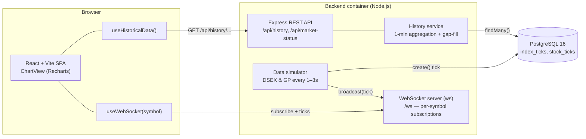

# System Architecture

Real-time stock chart for the Dhaka Stock Exchange (DSE). This document covers
the components, the end-to-end data flow, the technology choices behind each
component, and the trade-offs involved.

**Stack:** React + Vite · Node.js + Express · PostgreSQL 16 · Prisma · WebSocket (`ws`) · Docker Compose

---

## 1. Component overview



| Component     | Where                                 | Responsibility                                                                                                                 |
| ------------- | ------------------------------------- | ------------------------------------------------------------------------------------------------------------------------------ |
| **Frontend**  | `frontend/` (React + Vite)            | Renders the chart, loads history on mount, subscribes to live ticks, shows the "Market is Closed" screen, instrument dropdown. |
| **Backend**   | `backend/src/` (Express)              | REST API for history/status, hosts the WebSocket server and the simulator on the same HTTP server/port.                        |
| **Database**  | PostgreSQL 16 (via Prisma)            | Durable store of every tick in `index_ticks` and `stock_ticks`.                                                                |
| **Simulator** | `backend/src/services/simulator.ts`   | Produces DSEX/GP ticks on random 1–3s cadences while the market is open; persists and broadcasts each.                         |
| **WebSocket** | `backend/src/websocket/marketFeed.ts` | Transport layer: tracks per-client symbol subscriptions and fans out ticks to matching subscribers.                            |

### Backend internal modules

- `config.ts` — env-driven config + `isMarketOpen()`.
- `types.ts` — shared tick / history data contracts.
- `utils/marketTime.ts` — converts `HH:MM` (Asia/Dhaka) to epoch ms; shared by the seed, simulator window logic, and history service.
- `services/db.ts` — shared Prisma client + `BigInt` JSON serialization (the `time` columns are `BIGINT`).
- `services/history.ts` — the 1-minute aggregation + forward-fill logic.
- `services/simulator.ts` — the live producer.
- `websocket/marketFeed.ts` — WS transport and `broadcast()`.
- `routes/` — `health`, `market-status`, `history`, `quotes`.

### Frontend internal modules

- `hooks/useHistoricalData(symbol)` — fetches the REST history on mount/symbol change.
- `hooks/useWebSocket(symbol)` — connects, subscribes, returns live ticks, auto-reconnects.
- `hooks/useChartData(symbol)` — merges history + live ticks into one gap-free 1-minute series.
- `components/ChartView.tsx` — the Recharts chart (colored points, reference line, heartbeat, tooltip).
- `utils/marketStatus.ts` — `isMarketOpen()` + `getSessionRange()` (the chart's X-axis span).

---

## 2. Data flow: simulator → DB → WebSocket → chart

### Write path (server-side, every 1–3s while open)

1. The **simulator** wakes on a per-symbol random timer (1–3s).
2. It checks `isMarketOpen()`. If closed, it does nothing and reschedules.
3. If open, it computes the next value as a **bounded random walk** around
   yesterday's close (DSEX: 5200 ±100; GP: 238.88 ±1).
4. It **persists** the tick: `prisma.indexTick.create(...)` /
   `prisma.stockTick.create(...)` → a new row in PostgreSQL.
5. It **broadcasts** the tick via `broadcast({ type:'tick', symbol, price, change, ... })`.
6. The **WebSocket server** sends that message only to clients whose
   subscription set contains `symbol`.

### Read path (client-side)

1. On mount, **`useHistoricalData`** calls `GET /api/history/index/DSEX` (or
   `/stock/GP`). The **history service** queries all ticks from market open →
   now, buckets them into **1-minute intervals (latest value per minute)**, and
   **forward-fills** missing minutes so there are no gaps.
2. **`useWebSocket`** opens `ws://…/ws`, sends `{ subscribe: <symbol> }`, and
   receives live ticks.
3. **`useChartData`** merges the two: it seeds a `Map<minute, value>` from the
   historical series, then folds each live tick into its minute bucket
   (**latest value wins per minute**). It produces a full-session array from
   market open → close — filled up to the latest data point, `null` afterwards.
4. **`ChartView`** renders it: each point is colored vs. yesterday's close, a
   dotted reference line marks yesterday's close, the latest point blinks, and
   the latest value sits in the top-right.

### One consistent rule across the stack

> **1-minute buckets, latest value per minute, forward-fill the gaps.**

This rule lives in the backend (`services/history.ts`) for the REST response and
in the frontend (`hooks/useChartData.ts`) for merging live ticks. Because both
use the same alignment (`floor(ms / 60000)`), the live updates line up exactly
with the historical grid.

---

## 3. Technology choices — what and why

| Choice                          | Why                                                                                                                                                                                                                                                                                                                                                                                                                                                                                                                           |
| ------------------------------- | ----------------------------------------------------------------------------------------------------------------------------------------------------------------------------------------------------------------------------------------------------------------------------------------------------------------------------------------------------------------------------------------------------------------------------------------------------------------------------------------------------------------------------- |
| **TypeScript (FE + BE)**        | One typed language across the whole stack. The tick and history shapes that cross the process boundary are defined once per side (`backend/src/types.ts`, `frontend/src/types.ts`) so the simulator, WS feed, REST layer, and chart all agree on the contract at compile time. Prisma generates model types from the schema, so DB rows are typed end-to-end with no hand-written DTOs. Catches an entire class of shape/null bugs before runtime — valuable for real-time code where a malformed tick is hard to debug live. |
| **Node.js + Express**           | Single language across the stack (TypeScript), tiny HTTP surface, and — crucially — the **`ws` server attaches to the same `http.Server`** Express uses, so REST and WebSocket share one port with zero extra infra.                                                                                                                                                                                                                                                                                                          |
| **`ws` library**                | The de-facto minimal WebSocket implementation for Node. No opinionated framing/rooms we don't need — we implement a tiny subscribe protocol ourselves, which keeps the contract explicit and debuggable.                                                                                                                                                                                                                                                                                                                      |
| **PostgreSQL**                  | Tick data is structured, append-heavy, and benefits from indexed range scans by `(symbol, time)`. A relational store with a composite index serves the "open → now" history query efficiently and is rock-solid for durability.                                                                                                                                                                                                                                                                                               |
| **Prisma ORM**                  | Type-safe queries, a declarative schema, and a **migration workflow** that runs non-interactively in the container (`migrate deploy`). The generated client makes the aggregation code readable.                                                                                                                                                                                                                                                                                                                              |
| **React + Vite**                | Vite gives instant dev start/HMR; React's hook model fits this app perfectly — `useHistoricalData`/`useWebSocket`/`useChartData` cleanly separate "load once", "stream", and "merge".                                                                                                                                                                                                                                                                                                                                         |
| **Recharts**                    | Declarative, React-native charting. Custom dot renderers let us color each point vs. yesterday's close and attach a CSS heartbeat to just the latest point, while `ReferenceLine` draws the dotted close line — all without imperative canvas code.                                                                                                                                                                                                                                                                           |
| **Docker Compose**              | One command brings up the whole stack with correct ordering via health checks (postgres → backend → frontend) and a named volume for durable data.                                                                                                                                                                                                                                                                                                                                                                            |
| **Simulator (in-process)**      | DSE has no free public real-time feed, so a simulator stands in for the exchange. Running it **in the backend process** means it can reuse the same Prisma client and `broadcast()` function — the rest of the system can't tell it isn't a real feed.                                                                                                                                                                                                                                                                        |
| **Plain CSS (no UI framework)** | The chart has precise visual requirements (per-point colors, heartbeat animation on the latest data point, dynamic color changes based on live values). Vanilla CSS gave full control without fighting against a utility framework's conventions — the right tool for a highly custom data visualization component.                                                                                                                                                                                                           |

---

## 4. Design decisions & trade-offs

### TypeScript run via `tsx` (no separate build step)

Both services are authored in TypeScript. The backend runs directly through
**`tsx`** (`tsx watch` in dev, `tsx src/index.ts` in the container) instead of a
`tsc → dist/ → node` pipeline; the frontend is compiled by Vite. Type safety is
still enforced via `npm run typecheck` (`tsc --noEmit`) and `tsc` runs as part of
the frontend `build`. **Trade-off:** running `.ts` through `tsx` skips an
ahead-of-time compile, so type _errors_ don't block `start` (only `typecheck`
does), and there's a small per-start transpile cost. **Justification:** for this
take-home it keeps the dev loop and Docker entrypoint simple (no build artifacts
to manage) while still giving full editor + CI type checking. For production,
swap to `tsc` build + `node dist/` (the `build` script is already provided).

### Same port for REST + WebSocket

The `ws` server is attached to Express's underlying `http.Server`, so both run on
`PORT` (4000). **Trade-off:** can't scale REST and WS independently behind
different load balancers. **Justification:** for a single-instance app this
removes a whole class of CORS/port/config problems and simplifies deployment; it
can be split later if needed.

### Simulator is the single producer; WebSocket is transport-only

The simulator both **writes to the DB** and **calls `broadcast()`**. The WS module
holds no business logic. **Trade-off:** the DB write and the broadcast aren't in a
single transaction — a client could in theory get a tick the DB hasn't committed.
**Justification:** ticks are idempotent, append-only, and low-stakes; coupling
them to a distributed transaction would add complexity for no real benefit here.

### Persist every tick (raw), aggregate on read

We store raw 1–3s ticks and compute 1-minute buckets at query time.
**Trade-off:** more rows and repeated aggregation work per request vs.
pre-aggregating into minute candles on write. **Justification:** raw data is the
source of truth — we can change the bucket size or add new aggregations later
without a backfill. At DSE volumes (two symbols) the row count is trivial, and the
`(symbol, time)` index keeps the range scan fast.

### 1-minute buckets with forward-fill (no gaps)

A continuous minute grid makes the chart's X-axis stable and the line unbroken
even when ticks are sparse. **Trade-off:** forward-filled minutes aren't "real"
observations — they repeat the last value. **Justification:** this is standard for
price charts (a price persists until it changes) and avoids misleading gaps.

### Latest-value-per-minute (not average / OHLC)

If several ticks land in the same minute we keep the **last** one. **Trade-off:**
we lose intra-minute high/low. **Justification:** the product shows a single live
line, not candlesticks; "last price in the minute" is the natural value for that,
and it matches how the live point updates.

### Market hours in env, evaluated in Asia/Dhaka

Both backend and frontend compute "open/closed" against the **market** timezone,
not the viewer's local time. **Trade-off:** a little timezone math on both sides
(`Intl.DateTimeFormat` + an offset trick). **Justification:** correctness — a user
in another timezone still sees the DSE session correctly, and the gate matches the
simulator exactly.

### Idempotent startup (migrate + seed on every `up`)

The entrypoint runs `prisma migrate deploy` then `npm run seed` (`tsx prisma/seed.ts`); the seed
only inserts when tables are empty. **Trade-off:** a tiny startup cost each boot.
**Justification:** `docker compose up` "just works" on a fresh machine and is safe
to run repeatedly — no manual DB setup step.

### Dev-mode containers (bind mounts + Vite dev server)

Compose bind-mounts the source and runs the Vite dev server / `node` directly.
**Trade-off:** not a production-optimized image (no multi-stage build, no static
asset serving, larger images, the `node_modules` anonymous-volume gotcha).
**Justification:** fast iteration during development. A production variant would
add a multi-stage build (`vite build` → static server) and `npm ci --omit=dev`.

### Known limitations / future work

- **Single backend instance.** In-memory WS subscriptions and the in-process
  simulator don't scale horizontally. Multi-instance would need a pub/sub
  (e.g. Redis) to fan ticks across nodes and a single simulator owner.
- **No auth / rate limiting** on the API or WS.
- **No automated test suite** yet (logic was verified with targeted scripts and a
  live end-to-end Compose run).
- **WS delivers latest tick, not a replay** — a client that connects mid-session
  relies on the REST history for the backfill, then live ticks for the tail.

---

## 5. API & data contracts (quick reference)

### REST

| Method & path                  | Returns                                                 |
| ------------------------------ | ------------------------------------------------------- |
| `GET /api/health`              | `{ status, service, time }`                             |
| `GET /api/market-status`       | `{ open, openTime, closeTime, timezone, serverTime }`   |
| `GET /api/history/index/:id`   | `[{ time, value, yesterdayClose }]` (1-min, gap-filled) |
| `GET /api/history/stock/:code` | `[{ time, value, yesterdayClose }]` (1-min, gap-filled) |

### WebSocket (`/ws`)

Client → server: `{ "subscribe": "DSEX" }`, `{ "unsubscribe": "GP" }`
Server → client:

```jsonc
{ "type": "welcome", "marketOpen": true }
{ "type": "subscribed", "symbol": "DSEX" }
{ "type": "tick", "symbol": "DSEX", "price": 5207.27, "change": 1.2,
  "marketOpen": true, "timestamp": "2026-06-03T16:42:19.958Z" }
```

### Database

```
index_ticks(id, index_id, time BIGINT, capital_value,
            percentage_change_from_yesterday_close_value, yesterday_close_value)
stock_ticks(id, trade_code, time BIGINT, close_price, yesterday_close_price)
-- time is unix epoch milliseconds; indexed on (symbol, time)
```

---

## 6. Drawing the architecture diagram visually

The diagram in §1 is written in **Mermaid**, which is the recommended tool here:

- **Mermaid** (<https://mermaid.live>) — text-based diagrams that render directly
  in GitHub/GitLab Markdown and in the Mermaid Live Editor. The `flowchart`
  block above is ready to paste. Best when you want the diagram to live **in the
  repo** and stay diffable in version control.

Good alternatives depending on your preference:

- **Excalidraw** (<https://excalidraw.com>) — hand-drawn, whiteboard feel; great
  for a quick, friendly diagram to drop into a slide or the README as a PNG/SVG.
- **draw.io / diagrams.net** (<https://app.diagrams.net>) — full-featured boxes-
  and-arrows editor with AWS/Azure/DB icon sets; exports SVG/PNG and can save the
  source `.drawio` file in the repo.
- **tldraw** (<https://tldraw.com>) — fast, modern infinite-canvas sketching.

**Recommendation:** keep the **Mermaid** source in this file (it versions with the
code and renders on GitHub automatically), and if you need a polished image for a
presentation, recreate it in **Excalidraw** or **draw.io** and export an SVG into
`docs/`.
